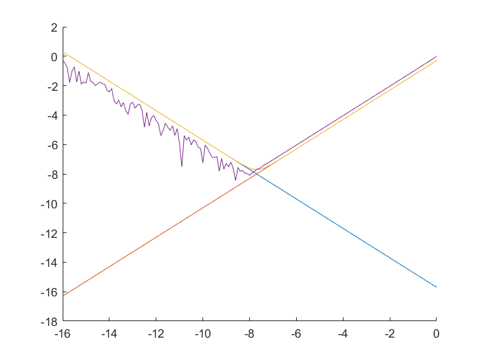

# 误差分析实验报告

冯卓尔  计86  201701998

## 实验要求

### 实验题目

用MATLAB变成实现例1.4，绘出图1-2，体会两种误差对结果的不同影响


### 解题思路

由于$$f(x+h)=f(x)+hf'(x)+\dfrac{h^2}{2}f''(\xi )$$ ，那么实际误差为$$||\dfrac{sin(1+h) - sin(1)}{h} - cos(1)||$$。

截断误差为$$\dfrac{Mh}{2}$$ ,舍入误差为$$\dfrac{2\epsilon}{h}$$，误差限为两者之和。

具体的实现见代码。



###实验结论

在h较小的情况下，舍入误差对实际误差的影响较大，原因是h较小时，对于每一步计算中的浮点数误差扩大了；

在h较大的情况下，截断误差对实际误差的影响较大，原因是截断误差是算法本身的问题，也即是h较大的情况下计算过程中的舍入误差相对小了，而理论中的二次项部分因为h的放大作用误差变大。


### 代码

```matlab

count = 0
for t = -16.0:0.1:0.0
    count = count + 1
    h(count) = 10. ^t
    sheru(count) = log10(2e-16) - t
    jieduan(count) = log10(h(count) / 2)
    total(count) = log10( h(count) / 2 + 2e-16 / h(count))
    real(count) =  log10(abs((sin(1 + h(count)) - sin(1)) / h(count) - cos(1)) + 10. ^jieduan(count))
    
end
sheru
jieduan
total
real
hold on
plot(log10(h), sheru)
plot(log10(h), jieduan)
plot(log10(h), total)
plot(log10(h), real)

```

