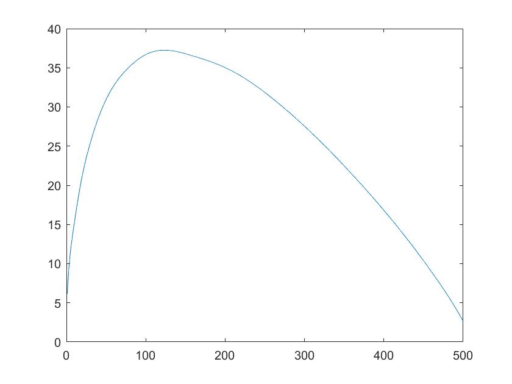
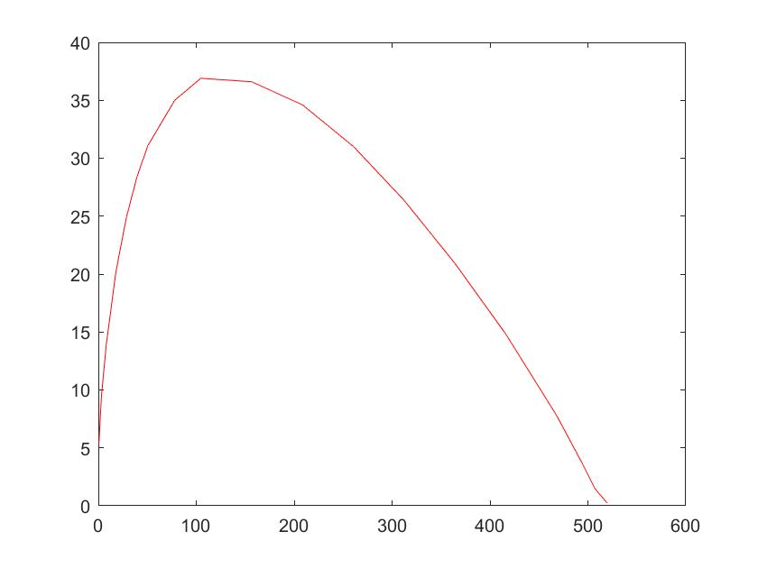
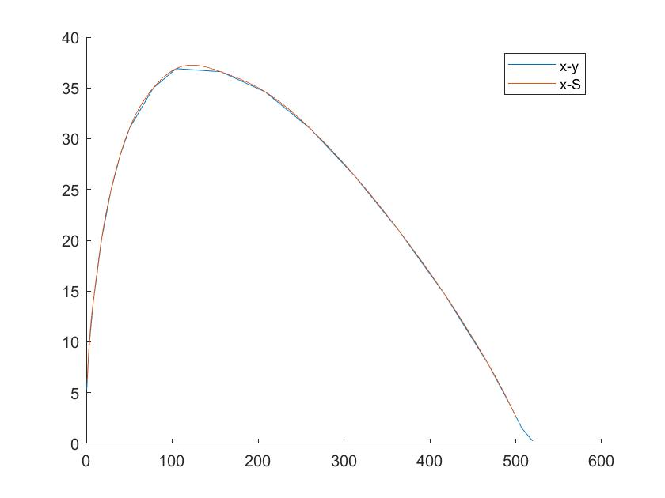

# 函数插值：三次样条函数插值

冯卓尔  计86  201701998

## 实验要求

### 实验题目

已知以下数据

| x    | 0.52  | 3.1   | 8      | 17.95 | 28.65 | 39.62 | 50.65 | 78   | 104.6 | 156.6 |
| ---- | ----- | ----- | ------ | ----- | ----- | ----- | ----- | ---- | ----- | ----- |
| y    | 5.288 | 9.4   | 13.84  | 20.20 | 24.90 | 28.44 | 31.10 | 35   | 36.9  | 36.6  |
| x    | 208.6 | 260.7 | 312.50 | 364.4 | 416.3 | 468   | 494   | 507  | 520   |       |
| y    | 34.6  | 31.0  | 26.34  | 20.9  | 14.8  | 7.8   | 3.7   | 1.5  | 0.2   |       |


### 解题思路

按照课本所述样条插值算法进行操作。值得注意的是，由于分段线性Hermite插值（两点三次）在本题中是可以使用的，由于
$$
S_3(x) = f_i\alpha_i(x) + f_{i+1}\alpha_{i+1}(x) + m_i\beta_i(x) + m_{i+1}\beta_{i+1}(x) \\
S_3'(x) = f_i\alpha_i'(x) + f_{i+1}\alpha_{i+1}'(x) + m_i\beta_i'(x) + m_{i+1}\beta_{i+1}'(x) \\
S_3''(x) = f_i\alpha_i''(x) + f_{i+1}\alpha_{i+1}''(x) + m_i\beta_i''(x) + m_{i+1}\beta_{i+1}''(x) \\
\alpha_i(x) = (1+2\dfrac{x-x_i}{x_{i+1}-x_i})(\dfrac{x-x_{i+1}}{x_i-x_{i+1}})^2 \\
\alpha_{i+1}(x) = (1+2\dfrac{x-x_{i+1}}{x_{i}-x_{i+1}})(\dfrac{x-x_{i}}{x_{i+1}-x_{i}})^2 \\
\beta_i(x) = (x-x_i)(\dfrac{x-x_{i+1}}{x_i-x_{i+1}})^2 \\
\beta_{i+1}(x) = (x-x_{i+1})(\dfrac{x-x_{i}}{x_{i+1}-x_{i}})^2 \\
\\
\alpha_i'(x) = \dfrac{2}{x_{i+1}-x_i}(\dfrac{x-x_{i+1}}{x_i-x_{i+1}})^2-\dfrac{2}{x_{i+1}-x_i}(1+2\dfrac{x-x_i}{x_{i+1}-x_i})(\dfrac{x-x_{i+1}}{x_{i}-x_{i+1}})\\
\alpha_{i+1}'(x) = \dfrac{2}{x_{i}-x_{i+1}}(\dfrac{x-x_{i}}{x_{i+1}-x_{i}})^2-\dfrac{2}{x_{i}-x_{i+1}}(1+2\dfrac{x-x_{i+1}}{x_{i}-x_{i+1}})(\dfrac{x-x_{i}}{x_{i+1}-x_{i}})\\

\beta_i'(x) = (\dfrac{x-x_{i+1}}{x_i-x_{i+1}})^2 + 2\dfrac{x-x_i}{x_i-x_{i+1}}(\dfrac{x-x_{i+1}}{x_i-x_{i+1}}) \\
\beta_{i+1}'(x) = (\dfrac{x-x_{i}}{x_{i+1}-x_{i}})^2 + 2\dfrac{x-x_{i+1}}{x_{i+1}-x_{i}}(\dfrac{x-x_{i}}{x_{i+1}-x_{i}}) \\

\alpha_i''(x) = \dfrac{8(x-x_{i+1})}{(x_{i+1}-x_i)^3} + \dfrac{2}{(x_{i+1} - x_i)^2} + \dfrac{4(x-x_i)}{(x_{i+1}-x_i)^3} \\
\alpha_{i+1}''(x) = \dfrac{8(x-x_{i})}{-(x_{i+1}-x_i)^3} + \dfrac{2}{(x_{i+1} - x_i)^2} + \dfrac{4(x-x_{i+1})}{-(x_{i+1}-x_i)^3} \\

\beta_i''(x) = \dfrac{4(x-x_{i+1})}{(x_{i+1}-x_i)^2} + \dfrac{2(x-x_i)}{(x_{i+1}-x_i)^2} \\
\beta_{i+1}''(x) = \dfrac{4(x-x_{i})}{(x_{i}-x_{i+1})^2} + \dfrac{2(x-x_{i+1})}{(x_{i}-x_{i+1})^2} \\
$$
其中，m可以有固定边界条件求出，$$m_0 = f'_0, m_n = f'_n$$ 
$$
A = 
	\left[
	\begin{matrix}
	2 & \lambda_1   &              &            &   \\
	\mu_2 & 2 & \lambda_2       &            &   \\
	         & \mu_3         & 2 & \ddots     &   \\
	         &                  & \ddots           & 2     & \lambda_{n-2}  \\
	         &                  &                  & \mu_{n-1}   & -(2\epsilon + h)  \\	         
	\end{matrix}
	\right]
	\\
M = 
	\left[
	\begin{matrix}
	m_1 \\
	m_2\\
	\vdots \\
	m_{n-1}
	\end{matrix}
	\right]
\qquad
D = 
	\left[
	\begin{matrix}
	d_1 - \mu_1m_0 \\
	d_2\\
	\vdots \\
	d_{n-2} \\
	d_{n-1}-\lambda_{n-1}m_n
	\end{matrix}
	\right] \\
	s.t. \qquad AM = D
$$


追赶法解方程即可。由于先前有一个高斯求方程算法，为了节省时间直接调用。原因是这题中n=19，计算量差的上限不超过$$10^6$$，在数值计算上表现出来不超过0.01s，因而可以。

最后，对于所求x，首先判断出它在区间中的位置序列t，随后调用相应的三次函数计算它的函数值、一次导数值、二次导数值。结果在数据中。

###插值曲线

####三次样条插值曲线



####数据点两两相连



####两条曲线绘于一图中




###实验结果

| $$x$$ | $$f(x)$$ | $$f'(x)$$ | $$f''(x)$$ |
| ----- | -------- | --------- | ---------- |
| 2     | 7.8252   | 1.5538    | -7.8221    |
| 30    | 25.3862  | 0.3549    | -1.5397    |
| 130   | 37.2138  | -0.0104   | -0.0442    |
| 350   | 22.4751  | -0.1078   | 0.1743     |
| 515   | 0.5427   | -0.0899   | 0.1880     |


###代码

```matlab
function x=gaosixiaoqu(A,b,n)
for k=1:(n-1)
    for i=(k+1):n
        piv=A(i,k)/A(k,k);
        b(i)=b(i)-piv*b(k);
        for j=k:n
            A(i,j)=A(i,j)-piv*A(k,j);
        end
    end
end
clear i
clear j
clear k

x=zeros(n,1);
x(n)=b(n)/A(n,n);
for i=(n-1):-1:1
        for j=(i+1):n
            x(i)=-x(j)*A(i,j)/A(i,i)+x(i);
        end
        x(i)=x(i)+b(i)/A(i,i);
end
```

```matlab

function [y,y1,y2]=yangtiao(a)

x=[0.52,3.1,8,17.95,28.65,39.62,50.65,78,104.6,156.6,208.6,260.7,312.5,364.4,416.3,468,494,507,520];
f=[5.288,9.4,13.84,20.2,24.9,28.44,31.1,35,36.9,36.6,34.6,31,26.34,20.9,14.8,7.8,3.7,1.5,0.2];

zt=length(x);

for i=1:zt-1
    h(i)=x(i+1)-x(i);
end
for i=1:zt-2
    u(i)=h(i+1)/(h(i+1)+h(i));
    l(i)=1-u(i);
end
    
for i=1:zt-1
    g(i)=(f(i+1)-f(i))/(x(i+1)-x(i));
end

for i=1:zt-2
    d(i)=3*(u(i)*g(i)+l(i)*g(i+1));
end

m0=1.86548;
mzt=-0.046115;

A=zeros(zt-2,zt-2);
for i=1:zt-2
    A(i,i)=2;
end

for i=1:zt-3
    A(i+1,i)=u(i+1);
    A(i,i+1)=l(i);
end

b=zeros(zt-2,1);
b(1)=d(1)-u(1)*m0;
b(zt-2)=d(zt-2)-l(zt-2)*mzt;

for i=2:1:zt-3
    b(i)=d(i);
end

M=gaosixiaoqu(A,b,zt-2);
m=zeros(zt,1);
m(1)=m0;
m(zt)=mzt;
for i=1:zt-2
    m(i+1)=M(i);
end

x(zt+1)=a;
x_order=sortrows(x);
t=find(x_order==a);
t=t-1;

y=0;
y=f(t)*(1+2*(a-x(t))/(x(t+1)-x(t)))*((a-x(t+1))/(x(t)-x(t+1)))^2;
y=y+f(t+1)*(1+2*(a-x(t+1))/(x(t)-x(t+1)))*((a-x(t))/(x(t+1)-x(t)))^2;
y=y+m(t)*(a-x(t))*((a-x(t+1))/(x(t)-x(t+1)))^2;
y=y+m(t+1)*(a-x(t+1))*((a-x(t))/(x(t+1)-x(t)))^2;

y1=0;
y1=f(t)*(2/(x(t+1)-x(t))*((a-x(t+1))/(x(t)-x(t+1)))^2-2/(x(t+1)-x(t))*(1+2*(a-x(t))/(x(t+1)-x(t)))*(a-x(t+1))/(x(t)-x(t+1)));
y1=y1+f(t+1)*(2/(x(t)-x(t+1))*((a-x(t))/(x(t+1)-x(t)))^2-2/(x(t)-x(t+1))*(1+2*(a-x(t+1))/(x(t)-x(t+1)))*(a-x(t))/(x(t+1)-x(t)));
y1=y1+m(t)*(((a-x(t+1))/(x(t)-x(t+1)))^2+2*(a-x(t))/(x(t)-x(t+1))*(a-x(t+1))/(x(t)-x(t+1)));
y1=y1+m(t+1)*(((a-x(t))/(x(t+1)-x(t)))^2+2*(a-x(t+1))/(x(t+1)-x(t))*(a-x(t))/(x(t+1)-x(t)));

y2=0;
y2=f(t)*(8*(a-x(t+1))/(x(t+1)-x(t))^3+2/(x(t+1)-x(t))+4*(a-x(t))/(x(t+1)-x(t))^3);
y2=y2+f(t+1)*(8*(a-x(t))/(x(t)-x(t+1))^3+2/(x(t)-x(t+1))+4*(a-x(t+1))/(x(t)-x(t+1))^3);
y2=y2+m(t)*(4*(a-x(t+1))/(x(t+1)-x(t))^2+2*(a-x(t))/(x(t+1)-x(t))^2);
y2=y2+m(t+1)*(4*(a-x(t))/(x(t)-x(t+1))^2+2*(a-x(t+1))/(x(t)-x(t+1))^2);

% end
```


