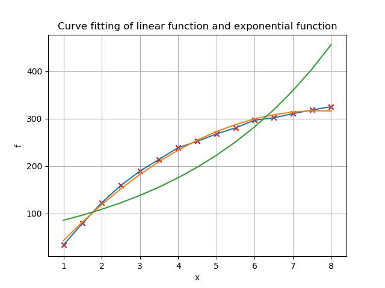

# 最小二乘法$-$法方程实现曲线拟合

冯卓尔  计86 2017011998

##实验要求

###实验题目

对物理实验中所得下列数据

| $$t_i$$ | 1     | 1.5    | 2      | 2.5    | 3.0    | 3.5    | 4      |        |
| :-----: | ----- | ------ | ------ | ------ | ------ | ------ | ------ | ------ |
| $$y_i$$ | 33.40 | 79.50  | 122.65 | 159.65 | 189.15 | 214.15 | 238.65 |        |
| $$t_i$$ | 4.5   | 5      | 5.5    | 6      | 6.5    | 7      | 7.5    | 8      |
| $$y_i$$ | 252.2 | 267.55 | 280.50 | 296.65 | 301.65 | 210.40 | 218.15 | 325.15 |

（1）用公式$$y=a+bt+ct^2$$做曲线拟合

（2）用指数函数$$y=ae^bt$$做曲线拟合

（3）比较上述两条拟合曲线，哪条更好？


###算法描述

按照课本算法6.2的描述，对于一组给定的基函数$$\phi_1(x), \phi_2(x), …,\phi_n(x)$$和数据点$$(x_i, f(x_i)), i = 0, 1, … ,m$$，最小二乘法求$$f(x)$$的拟合曲线$$y=\sum_{i = 1}^na_i\phi_i(x)$$中系数$$x = [x_1, x_2, …, x_n]^T$$，使用法方程法
$$
A = 
	\left[
	\begin{matrix}
	\phi_1(t_1) & \phi_2(t_1) & \cdots & \phi_n(t_1)\\
	\phi_1(t_2) & \phi_2(t_2) & \cdots & \phi_n(t_2)\\
	\vdots      & \vdots      & \ddots & \vdots \\
	\phi_1(t_m) & \phi_2(t_m) & \cdots & \phi_n(t_m)\\
	\end{matrix}
	\right]
$$

$$
G = A^T A \\
b = A^T f	\\
cholesky分解\ G = L^T L \\
L^T L x = b \\
L^T y = b \\
Lx = y\\
$$

解得x

（1）取定$$\phi_1(x) = 1$$，$$\phi_2(x) = x$$，$$\phi_3(x)=x^2$$，依照算法得出结果，均方误差为5.683931823476425

（2）先对$$y=ae^{bt}$$两边取对数，得$$\ln(y) = ln(a) + bt$$。则现在取$$\phi_1(x) = 1$$，$$\phi_2(x) = x$$，f的每一个元素依次取对数。带入算法解得系数$$\ln(a)$$与b。随后回代计算均方误差$$real\_f = a * e^{bt}，$$$$\Delta f = real\_f -f$$，得到均方误差为56.52224402531076。

（3）画图

- 

其中，红点为数据点，蓝线为插值拟合曲线，橙线为（1）中线性拟合曲线，绿线为（2）中指数函数拟合曲线。

###代码

```python
import numpy as np 
import matplotlib
import matplotlib.pyplot as plt

# phi 1, t, t^2
A = np.array([
    [1, 1, 1], 
    [1, 1.5, 2.25], 
    [1, 2, 4], 
    [1, 2.5, 6.25], 
    [1, 3, 9], 
    [1, 3.5, 12.25], 
    [1, 4, 16], 
    [1, 4.5, 20.25]])
def devide():
    print("-----------------------------------------")

if __name__ == "__main__":   
    t = np.array([1, 1.5, 2, 2.5, 3, 3.5, 4, 4.5, 5, 5.5, 6, 6.5, 7, 7.5, 8])
    f = np.array([33.4, 79.5, 122.65, 159.05, 189.15, 214.15, 238.65, 252.2, 267.55, 280.5, 296.65, 301.65, 310.4, 318.15, 325.15])
    f = np.transpose(f)
    t_1 = np.ones(15)
    t_2 = t.copy()
    t_3 = t * t 
    a = np.vstack((t_1, t_2, t_3))
    b = np.dot(a, f)
    temp = np.transpose(a)
    G = np.dot(a, temp)
    L = np.linalg.cholesky(G)
    L_inv = np.linalg.inv(L)
    y = np.dot(L_inv, b)
    LT = np.transpose(L)
    LT = np.linalg.inv(LT)

    x = np.dot(LT, y)

    direct_x = np.dot (np.linalg.pinv(np.transpose(a)), f)

    real_f = x[0] * t_1 + x[1] * t_2 + x[2] * t_3
    delta_f = real_f - f
    delta = np.linalg.norm(delta_f) / np.sqrt(15)
    
    print(a)
    devide()
    print(f)
    devide()
    print(b)
    devide()
    print(G)
    devide()
    print(L)
    devide()
    print(y)
    devide()
    print(x)
    devide()
    print(direct_x)
    devide()
    print(f)
    devide()
    print(real_f)
    devide()
    print(delta_f)
    devide()
    print(delta)

    fig, ax = plt.subplots()
    ax.plot(t, f)
    ax.plot(t, real_f)
    ax.set(xlabel='x', ylabel='f', title='Curve fitting of linear function and exponential function')
    ax.grid()
    for i in range(len(t)):
        plt.scatter(t[i], f[i], marker = 'x', color = 'red')

    # fig.savefig("test.png")
    
    # x - f  x - real_f

    lnf = np.log(f)
    a = np.vstack((t_1, t_2))
    b = np.dot(a, lnf)
    G = np.dot(a, np.transpose(a))
    L = np.linalg.cholesky(G)
    L_inv = np.linalg.inv(L)
    y = np.dot(L_inv, b)
    L = np.transpose(L)
    x = np.dot( np.linalg.inv(L), y)
    numa = np.exp(x[0])
    real_f = numa * np.exp(x[1] * t_2)
    delta_f = real_f -f
    delta = np.linalg.norm(delta_f) / np.sqrt(15)
    ax.plot(t, real_f)

    print(lnf)
    devide()
    print(a)
    devide()
    print(b)
    devide()
    print(G)
    devide()
    print(L)
    devide()
    print(y)
    devide()
    print(x)
    devide()
    print(numa)
    print(x[1])
    devide()
    print(f)
    devide()
    print(real_f)
    devide()
    print(delta_f)
    devide()
    print(delta)
    plt.show()
   

```


 

